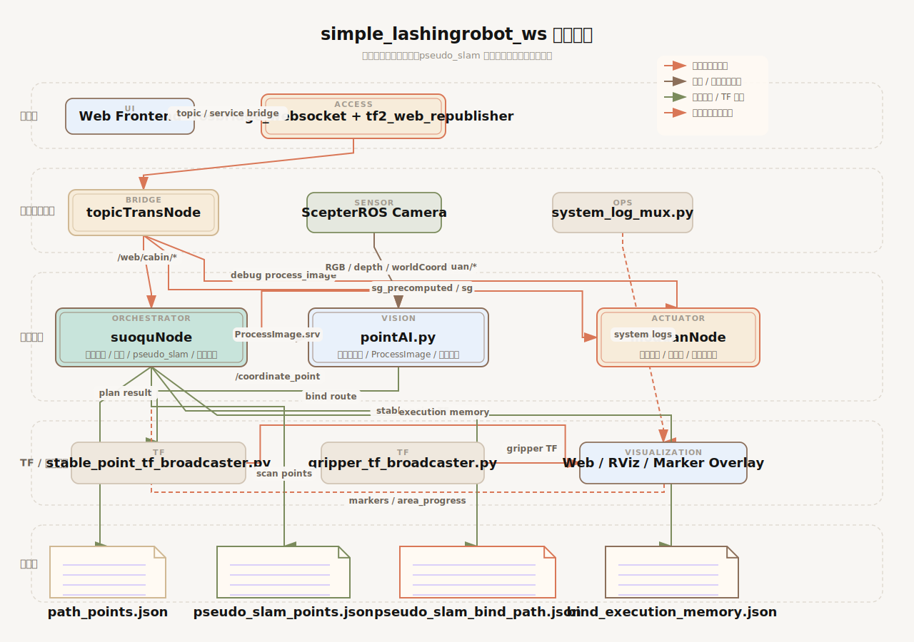
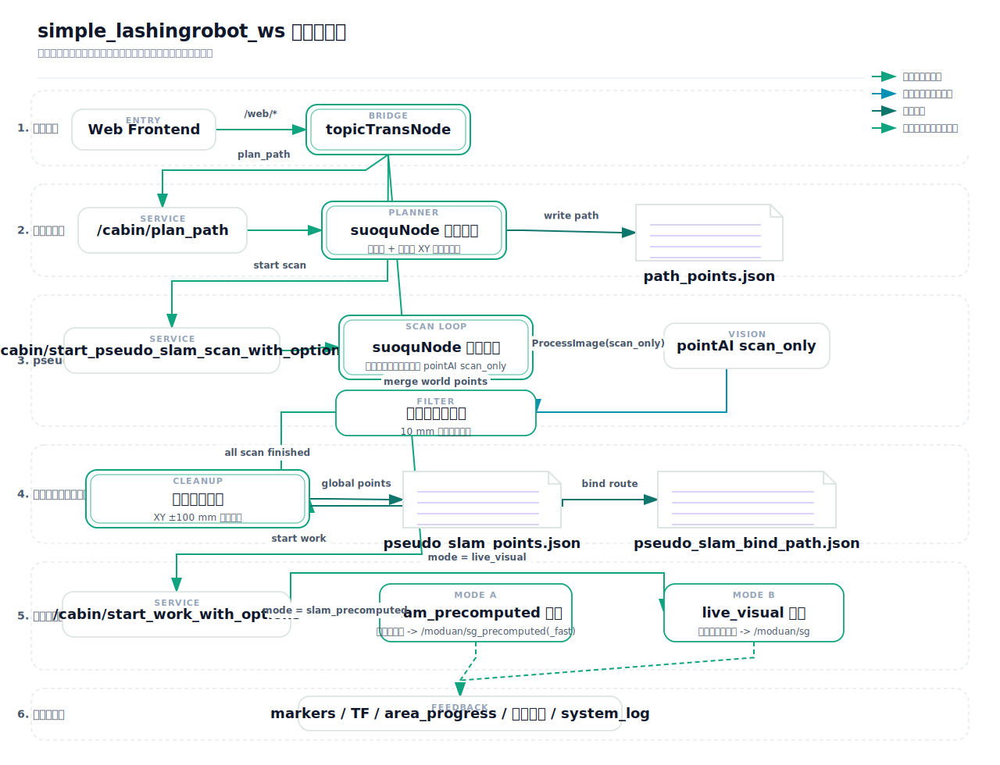

# `slam/v15` 工程架构与操作链总览

## 一句话先看懂

这个工程可以把它理解成一条 5 段式链路：

1. 前端把作业区参数和控制命令发进 ROS。
2. `topicTransNode` 把 `/web/*` 话题翻译成后端节点真正使用的 Service 调用。
3. `suoquNode` 负责主流程编排：规划路径、跑 `pseudo_slam` 扫描、组织全局执行。
4. `pointAI.py` 负责视觉识别，`moduanNode` 负责末端移动和绑扎动作。
5. 结果落到 `json` 文件里，同时通过 `TF`、`marker`、调试图像、日志回到前端和可视化界面。

## 图 1：整体架构图

这张图适合回答一个问题：这个工程里“谁和谁在通信，谁负责什么”。

最重要的几层是：

- 交互层：前端页面、`rosbridge_websocket`、`tf2_web_republisher`
- 桥接与传感层：`topicTransNode`、`ScepterROS` 相机、`system_log_mux.py`
- 主控制层：`suoquNode`、`pointAI.py`、`moduanNode`
- TF / 可视化层：`stable_point_tf_broadcaster.py`、`gripper_tf_broadcaster.py`、Web / RViz
- 数据层：`path_points.json`、`pseudo_slam_points.json`、`pseudo_slam_bind_path.json`、`bind_execution_memory.json`

## 图 2：整个工程的操作链

这张图适合回答另一个问题：前端按下一个按钮之后，系统到底会按什么顺序工作。

## 启动链怎么理解

工程平时主要看 3 个 launch：

- `src/chassis_ctrl/launch/api.launch`
  - 负责“前端入口和桥接入口”
  - 启动 `rosbridge_websocket`
  - 启动 `tf2_web_republisher`
  - 启动 `ScepterROS` 相机
  - 启动 `topicTransNode`
  - 启动 `system_log_mux.py`
- `src/chassis_ctrl/launch/run.launch`
  - 负责“主作业链”
  - 启动 `suoquNode`
  - 启动 `moduanNode`
  - 启动 `pointAI.py`
  - 启动 `gripper_tf_broadcaster.py`
  - 启动 `stable_point_tf_broadcaster.py`
- `src/chassis_ctrl/launch/suoquAndmoduan.launch`
  - 只拉起索驱和末端，不含主视觉节点

如果只想一句话记住：

- `api.launch` 解决“前端怎么进来”
- `run.launch` 解决“后端怎么干活”

## 前端命令进来以后，先经过谁

前端并不是直接操作 `suoquNode` 或 `moduanNode`，而是先把命令发到 `/web/*` 话题，再由 `topicTransNode` 统一转发。

最常见的入口有这些：

- `/web/cabin/plan_path`
  - 转到 `/cabin/plan_path`
  - 用来规划作业路径
- `/web/cabin/start_pseudo_slam_scan`
  - 转到 `/cabin/start_pseudo_slam_scan_with_options`
  - 用来启动扫描建图
- `/web/cabin/start_global_work`
  - 转到 `/cabin/start_work_with_options`
  - 用来启动全局执行
- `/web/moduan/single_bind`
  - 用来做定点绑扎调试或当前区域绑扎
- `/web/cabin/cabin_move_debug`
  - 用来调试索驱移动
- `/web/moduan/moduan_move_debug`
  - 用来调试末端线模移动
- `/web/fast_image_solve/process_image`
  - 用来调试视觉识别服务

所以可以把 `topicTransNode` 看成“前端翻译官”：

- 前端说的是 `/web/*`
- 后端真正干活的是 `/cabin/*`、`/moduan/*`、`/pointAI/*`

## `pseudo_slam` 建图主链，按顺序到底发生了什么

这部分是整个工程最核心的操作链。

### 第 1 步：先规划作业区

前端先给出：

- 原点
- 作业面长度 `X/Y`
- 扫描步距

然后：

1. 前端发 `/web/cabin/plan_path`
2. `topicTransNode` 转成 `/cabin/plan_path`
3. `suoquNode` 按当前原点和作业区尺寸计算离散扫描点
4. 结果写入 `src/chassis_ctrl/data/path_points.json`

这个文件可以理解成：“车之后准备去哪几个点扫描 / 作业”。

### 第 2 步：开始扫描建图

前端再发：

- `/web/cabin/start_pseudo_slam_scan`

然后流程是：

1. `topicTransNode` 转成 `/cabin/start_pseudo_slam_scan_with_options`
2. `suoquNode` 进入 `run_pseudo_slam_scan`
3. `suoquNode` 按 `path_points.json` 一块一块移动索驱
4. 每到一个区域，就调用 `pointAI` 的 `scan_only` 识别
5. `pointAI.py` 从 `ScepterROS` 的图像、深度、世界坐标数据里产出当前帧点集

### 第 3 步：扫描的时候先做第一层去重

这一层是“扫描时历史去重”，目的是别让同一个位置反复扫描、把点数撑爆。

当前 `slam/v15` 的规则是：

- 在扫描过程中，拿“已经接受过的历史点”跟“当前新点”比较
- 比较方式是 `XY` 平面的圆形欧式距离
- 阈值是 `10 mm`

也就是：

- 如果一个新点和之前已经扫过的点距离小于等于 `10 mm`
- 这个点就不再加入扫描结果

这层的意义是：

- 先在扫描阶段压住重复点数量
- 避免越扫越多，后处理压力太大

### 第 4 步：全部扫描完以后，再做第二层清洗

这层是“全局簇型清洗”，它不是单帧处理，而是整次扫描完成后，对全量点集再清一次。

当前 `slam/v15` 的规则是：

- 使用 `XY` 平面的方框阈值
- 判定条件是 `abs(dx) < 100 && abs(dy) < 100`

也就是你前面定下来的这条主链：

1. 扫描时用 `10 mm` 圆形欧式距离做历史去重
2. 扫描完成后再用 `XY ±100 mm` 方框阈值做全局簇型清洗

这一步结束以后，`suoquNode` 会把结果写进：

- `src/chassis_ctrl/data/pseudo_slam_points.json`
- `src/chassis_ctrl/data/pseudo_slam_bind_path.json`

同时会处理：

- `src/chassis_ctrl/data/bind_execution_memory.json`

你可以把这 3 个文件理解成：

- `pseudo_slam_points.json`：最终保留下来的全局扫描点
- `pseudo_slam_bind_path.json`：按区域组织好的后续绑扎路径
- `bind_execution_memory.json`：哪些点已经执行过，避免重复执行

## 扫描完成以后，怎么进入执行链

扫描完成后，前端再发：

- `/web/cabin/start_global_work`

它会被转成：

- `/cabin/start_work_with_options`

然后 `suoquNode` 会做模式选择。

当前主要是两种模式：

### 模式 A：`slam_precomputed`

这是“先扫描，后执行”的模式。

链路是：

1. 读取 `pseudo_slam_points.json`
2. 读取 `pseudo_slam_bind_path.json`
3. `suoquNode` 按预计算结果推进
4. 调用 `/moduan/sg_precomputed` 或 `/moduan/sg_precomputed_fast`
5. `moduanNode` 执行末端移动和绑扎

这个模式的特点是：

- 扫描和执行分开
- 执行阶段更稳定、更可控

### 模式 B：`live_visual`

这是“边走边看边绑”的模式。

链路是：

1. `suoquNode` 进入某个区域
2. 现场再次调用 `pointAI` 做视觉识别
3. 不依赖完整的 `pseudo_slam` 扫描产物
4. 直接调用 `/moduan/sg`
5. `moduanNode` 立刻执行当前区域绑扎

这个模式的特点是：

- 依赖实时视觉
- 灵活，但现场波动也更多

## `pointAI.py` 在整个系统里到底做什么

`pointAI.py` 是主视觉节点，可以把它理解成“点位生产机”。

它的主要职责是：

- 订阅 `ScepterROS` 相机输出
- 根据模式执行识别
- 提供 `/pointAI/process_image` 服务
- 发布调试图像到 `/pointAI/*`
- 发布 `/coordinate_point`

`/coordinate_point` 后面会被：

- `stable_point_tf_broadcaster.py` 消费

再变成稳定点位的 `TF`，方便前端和 RViz 看。

## `moduanNode` 在整个系统里到底做什么

`moduanNode` 可以理解成“末端动作执行器”。

它负责：

- 末端线模移动
- 定点绑扎
- 预计算绑扎执行

最常见的执行入口是：

- `/moduan/single_move`
- `/moduan/sg`
- `/moduan/sg_precomputed`
- `/moduan/sg_precomputed_fast`

也就是说：

- `suoquNode` 决定“什么时候绑、绑哪里”
- `moduanNode` 负责“真正把这个动作执行出来”

## 可视化和日志是怎么回来的

系统的回显不是只有一种，而是几条线一起回来：

- `suoquNode`
  - 发布 `/cabin/pseudo_slam_markers`
  - 发布 `/cabin/area_progress`
- `pointAI.py`
  - 发布调试图像 `/pointAI/*`
- `stable_point_tf_broadcaster.py`
  - 发布稳定点的 `TF`
- `gripper_tf_broadcaster.py`
  - 从 `gripper_tf.yaml` 发布抓手相关 `TF`
- `system_log_mux.py`
  - 聚合 `/rosout_agg` 和节点标准输出
  - 转到统一系统日志

所以前端上看到的“画面、点、框、状态、日志”，其实是从这些不同来源一起拼出来的。

## 关键文件，最容易混淆的地方

这里单独拎出来，因为最容易把“规划文件”和“扫描文件”混在一起。

### `path_points.json`

它表示：

- 规划出来的离散路径点

它回答的是：

- “系统准备去哪些位置扫描 / 作业”

### `pseudo_slam_points.json`

它表示：

- 扫描结束后保留下来的全局点集

它回答的是：

- “系统最终认为有哪些有效绑扎点”

### `pseudo_slam_bind_path.json`

它表示：

- 按区域组织好的后续执行路径

它回答的是：

- “这些点后面应该按什么顺序去绑”

### `bind_execution_memory.json`

它表示：

- 执行记忆

它回答的是：

- “哪些点已经绑过了，不要重复绑”

## 如果你只想记住最关键的 8 句话

1. 前端命令先到 `/web/*`，再由 `topicTransNode` 翻译成真正的后端调用。
2. `suoquNode` 是主编排节点，扫描、规划、执行都归它组织。
3. `pointAI.py` 负责视觉识别和点位产出。
4. `moduanNode` 负责把末端动作真正执行出来。
5. `path_points.json` 是“准备去哪”，不是“最终扫到了什么”。
6. `pseudo_slam_points.json` 才是“最终保留下来的扫描点”。
7. 当前 `pseudo_slam` 主链去重规则是：扫描时 `10 mm` 圆形欧式距离历史去重，扫描完成后 `XY ±100 mm` 方框簇型清洗。
8. 执行模式分两种：`slam_precomputed` 是“先扫后绑”，`live_visual` 是“边看边绑”。
